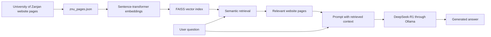

# University of Zanjan RAG Chatbot


A local retrieval-augmented generation (RAG) chatbot designed to answer questions using content collected from the University of Zanjan website. The project combines semantic search with a locally hosted language model, allowing responses to be generated from retrieved university-related information rather than from the language model alone.

## How It Works



The repository contains a previously collected dataset of university website pages in `znu_pages.json`. At runtime, the application:

1. Loads the stored website text.
2. Converts the pages into vector embeddings with Sentence Transformers.
3. Stores the embeddings in a FAISS index.
4. Retrieves the five most relevant pages for a question.
5. Sends the retrieved context and question to DeepSeek-R1 through a local Ollama server.
6. Returns the generated answer in the terminal.

## Features

- Retrieval-augmented question answering over university website content
- Semantic search using Sentence Transformers
- Efficient similarity search with FAISS
- Local response generation with DeepSeek-R1 and Ollama
- Automatic use of CUDA when a compatible GPU is available
- Support for Persian questions and Persian website content
- Retrieval and generation timing shown in the terminal

## Project Structure

```text
CHATBOT-RAG/
├── app.py             # Loads the data and runs the RAG pipeline
├── retriever.py       # Creates embeddings and retrieves relevant pages
├── generator.py       # Sends prompts to DeepSeek-R1 through Ollama
├── cleanup.py         # Utility for loading website data
├── gpu.py             # Small CUDA availability test
├── znu_pages.json     # Previously collected University of Zanjan pages
└── README.md
```

## Requirements

- Python 3.10 or newer
- [Ollama](https://ollama.com/)
- DeepSeek-R1 available in Ollama
- Internet access during the first setup to download the models
- Optional: an NVIDIA GPU with CUDA support

Python packages used by the project:

```text
faiss-cpu
numpy
requests
sentence-transformers
torch
```

> Depending on the operating system and hardware, FAISS installation may differ. A CPU installation is sufficient for running the current project.

## Installation

### 1. Clone the repository

```bash
git clone https://github.com/MaryamThk/CHATBOT-RAG.git
cd CHATBOT-RAG
```

### 2. Create and activate a virtual environment

```bash
python -m venv .venv
```

On Windows:

```bash
.venv\Scripts\activate
```

On macOS or Linux:

```bash
source .venv/bin/activate
```

### 3. Install the Python dependencies

```bash
pip install faiss-cpu numpy requests sentence-transformers torch
```

### 4. Install and prepare Ollama

Install Ollama, then download the language model:

```bash
ollama pull deepseek-r1
```

Ensure that Ollama is running. If needed, start its local server with:

```bash
ollama serve
```

## Usage

The current version runs as a command-line demonstration. Open `app.py` and change the value of `user_query` near the end of the file:

```python
user_query = "سامانه آموزش مجازی دانشکده انسانی"
```

Then run:

```bash
python app.py
```

The terminal displays the retrieval time, generation time, and final chatbot response.

## Dataset

`znu_pages.json` contains text previously collected from pages of the University of Zanjan website. Each record includes:

```json
{
  "url": "https://www.znu.ac.ir/...",
  "text": "Extracted page text..."
}
```

The crawler or scraper used to collect these pages is **not included** in this repository. The current project begins with the already collected JSON data and focuses on retrieval and response generation.

## Current Limitations

- The website dataset is static and may not reflect later changes to university pages.
- Website crawling and automatic dataset updates are not part of the repository.
- The current interface uses a question defined directly in `app.py` rather than an interactive web or chat interface.
- Answer quality depends on the relevance and cleanliness of the collected website text.
- The embedding model can be replaced with a multilingual model better optimized for Persian in a future version.

## Possible Improvements

- Add a Streamlit or Gradio chat interface
- Include a crawler that periodically updates the website dataset
- Display source URLs alongside each answer
- Use a multilingual embedding model optimized for Persian text
- Cache the FAISS index to avoid rebuilding it on every run
- Add configurable retrieval parameters and model settings
- Evaluate retrieval and answer quality on a small question set

## Author

**Maryam Tehranikia**  
[GitHub profile](https://github.com/MaryamThk)


